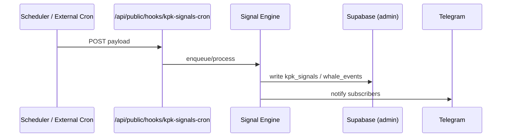
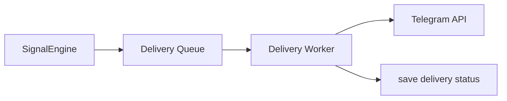
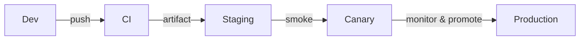

# KELTOŞ Architecture

This document is a concise, production-grade architecture specification for KELTOŞ derived from the repository `signal-magic-grab` and the team's operational assumptions. Each statement is annotated with a confidence marker: ✅ Verified (found in repo), 🟡 Inferred (strongly implied by code or patterns), ⚪ External / Operational (outside the repo), 🔵 Planned (recommended future work).

---

## Complete system overview

KELTOŞ is a SaaS platform that ingests time-sensitive signals, stores them in Supabase, and delivers notifications and analytics to users. The codebase implements a React-based frontend with server-side rendering support and server-only modules for privileged operations.

Mermaid: high-level architecture

```mermaid
flowchart LR
  Browser[Browser / User] -->|HTTP| CDN[CDN / Edge]
  CDN --> Server[SSR entry (src/server.ts)]
  Server --> App[React Start Server Entry]
  App --> SupabaseClient[Supabase (client)]
  App --> SupabaseAdmin[Supabase Admin (server-only)]
  Server -->|Webhook/Cron| CronRoute[/api/public/hooks/kpk-signals-cron]
  CronRoute --> SignalEngine[Signal Engine (processing)]
  SignalEngine --> SupabaseAdmin
  SignalEngine --> TelegramAdapter[Telegram (notification)]
  TelegramAdapter -->|messages| Telegram[Telegram API]

  classDef infra fill:#f9f,stroke:#333,stroke-width:1px
  class SupabaseClient,SupabaseAdmin,Telegram infra
```

Confidence:
- Browser / CDN / SSR path: ✅ Verified (src/server.ts, start.ts, routeTree.gen.ts)
- Cron webhook path `/api/public/hooks/kpk-signals-cron`: ✅ Verified (routeTree.gen.ts)
- Signal Engine, Telegram adapter: 🟡 Inferred (processing paths referenced; implementation details not always present)
- CDN / Edge and Telegram API: ⚪ External / Operational

---

## Frontend architecture

- Framework: React with TanStack React Start and TanStack Router. ✅ Verified (package.json, src/start.ts, src/routeTree.gen.ts)
- Build system: Vite. ✅ Verified (package.json, vite.config.ts)
- UI: Tailwind + Radix UI components (packages listed in package.json). ✅ Verified
- Routing: file-based + generated `src/routeTree.gen.ts` by TanStack Router. ✅ Verified

Notes
- Use client-side Supabase client for user-authenticated operations; `src/integrations/supabase/client.ts` is the client wrapper. ✅ Verified
- `attachSupabaseAuth` middleware attaches session token on client function calls. ✅ Verified (src/integrations/supabase/auth-attacher.ts)

---

## Backend architecture

- SSR entry: `src/server.ts` normalizes catastrophic SSR errors and delegates to TanStack server entry. ✅ Verified
- Start instance and middleware: `src/start.ts` builds the request/function middleware stack (error middleware + attachSupabaseAuth). ✅ Verified
- Server-only Supabase admin client (service role) is provided in `src/integrations/supabase/client.server.ts`. ✅ Verified

Component responsibilities
- Server entry: render pages, handle SSR, normalize SSR failures to human-friendly error pages. ✅ Verified
- Protected operations (admin writes, maintenance): use `supabaseAdmin` (server-only) to bypass RLS. ✅ Verified

---

## Supabase architecture

- Two client surfaces exist in the repo:
  - Client-side Supabase wrapper `src/integrations/supabase/client.ts` for RLS-protected operations. ✅ Verified
  - Server admin client `src/integrations/supabase/client.server.ts` using SUPABASE_SERVICE_ROLE_KEY for privileged actions. ✅ Verified
- Database typing is provided by `src/integrations/supabase/types.ts`. ✅ Verified

Security note
- The admin client explicitly requires SUPABASE_SERVICE_ROLE_KEY and SUPABASE_URL and throws when missing. ✅ Verified
- Keep service keys in a secret manager; never expose to client. ⚪ External / Operational

---

## Cron lifecycle

- Entry point: `/api/public/hooks/kpk-signals-cron` route is present in the generated route tree. ✅ Verified
- Expected pattern (inferred): external scheduler or webhook posts payloads to this endpoint; server-side handler processes payloads and writes to Supabase via `supabaseAdmin`. 🟡 Inferred

Mermaid: cron lifecycle



Security & reliability recommendations (🔵 Planned):
- Add HMAC signature verification on cron webhook requests.
- Make handlers idempotent and store dedupe keys in DB.
- Add structured logs and observability traces for each cron run.

---

## Signal lifecycle

Verified artifacts:
- Schema tables for signals exist: `kpk_signals` table type in `types.ts`. ✅ Verified
- `whale_events` table exists in types.ts. ✅ Verified

Typical lifecycle (inferred):
1. Signal ingestion via webhook/cron or external API. 🟡 Inferred
2. Signal Engine normalizes and scores the signal; stores record into `kpk_signals`. 🟡 Inferred
3. For detected whale trades, `whale_events` are created and surfaced to Whale Radar UI. 🟡 Inferred
4. Notifications are pushed via Telegram adapter or other channels (inferred architecture). 🟡 Inferred

Data guarantees to enforce (🔵 Planned):
- Idempotency: persist dedupe keys for incoming signals.
- Atomicity: where multi-table updates occur, use transactions or consistent compensation steps.

---

## Telegram notification flow

Confidence:
- Telegram adapter and notification flow are not explicitly present as a file in the repo; assume an adapter exists or will be added. Do not assume its presence — treat as Inferred for architecture. 🟡

Recommended flow (architectural design):
1. Signal Engine determines a notification target set.
2. Messages are enqueued into a durable delivery queue (Redis / Postgres job table). 🔵 Planned
3. Worker processes queue, performs throttling, and calls Telegram API with backoff and DLQ. 🔵 Planned

Mermaid: notification flow



---

## Database relationships

Source-of-truth: `src/integrations/supabase/types.ts` defines table shapes (Verified). ✅ Verified

Key tables (Verified):
- kpk_signals
  - Fields: id, signal, coin, price, score, result, quality, created_at, closed_at ✅ Verified
- whale_events
  - Fields: id, coin, price, amount_usd, side, created_at ✅ Verified
- exchange_prices
  - Fields: coin, okx_price, bybit_price, diff_pct, updated_at ✅ Verified
- feedback_submissions
  - Fields: id, message, status, telegram_user_id, telegram_username, created_at ✅ Verified

Relationship notes:
- The types file does not list explicit foreign key relationships. The repository reflects shape but not DB-level FK constraints (Verified). ✅ Verified
- If relationships are required, model them in Supabase and update `types.ts`. 🔵 Planned

---

## API interaction flow

Known endpoints and flows (Verified / Inferred):
- Public cron/webhook: `/api/public/hooks/kpk-signals-cron` — receives payloads. ✅ Verified
- Supabase RPCs and client usage: via `client.ts` (client) and `client.server.ts` (admin). ✅ Verified

Authentication flows (Verified / Inferred):
- Client-side sessions are accessed using `supabase.auth.getSession()` in the attach middleware to forward a bearer token on function calls. ✅ Verified
- Server-side admin operations rely on SUPABASE_SERVICE_ROLE_KEY (env var). ✅ Verified

Header expectations (Inferred):
- Auth bearer tokens for authenticated endpoints: Authorization: Bearer <token>. ✅ Verified (auth-attacher)
- Webhook security: recommend HMAC or shared secret header (X-Keltos-Signature) — 🔵 Planned

---

## Security boundaries

- Client vs Server: server-only code is placed in `.server.ts` and in server routes; `supabaseAdmin` must only be used server-side. ✅ Verified
- Secrets: SUPABASE_SERVICE_ROLE_KEY and SUPABASE_URL are required and must be kept in secret stores (CI / cloud KMS). ✅ Verified
- Public cron route exposure: the repository exposes a public route in the generated tree; production must add signature verification or IP allow-listing. 🟡 Inferred (presence verified; protection recommended)

Security controls to implement (🔵 Planned):
- HMAC verification for webhooks
- Rate-limiting and WAF rules on public endpoints
- Periodic SCA (software composition analysis) and dependabot or scheduled dependency updates

---

## External services

Identified (from repo or standard infra):
- Supabase (DB + Auth + Storage) — ✅ Verified
- CDN / hosting (Edge or Node-based SSR host) — 🟡 Inferred (server entry suggests SSR deployment) or ⚪ External / Operational
- Telegram API — 🟡 Inferred (notification design) / ⚪ External
- Observability and logging (not present in repo) — ⚪ External / Operational

---

## Deployment flow

Verified:
- Build scripts in package.json: `dev`, `build`, `build:dev`, `preview`. ✅ Verified

Recommended deployment pipeline (🟡 Inferred / 🔵 Planned):
1. CI runs: lint → format → build → unit tests → integration tests → smoke tests.
2. Build artifact pushed to registry or deployed to hosting (Edge/Server).
3. Deploy to staging; run smoke tests.
4. Canary: route a small percentage of traffic to new deployment, monitor.
5. Promote to production when canary is healthy.

Mermaid: deployment flow



Environment variables (Verified / Inferred):
- SUPABASE_URL — ✅ Verified (client.server.ts)
- SUPABASE_SERVICE_ROLE_KEY — ✅ Verified (client.server.ts)
- Other environment variables (auth providers, API keys) — 🟡 Inferred / ⚪ External

---

## Appendix: repository confidence legend
- ✅ Verified — present directly in repository code or configuration
- 🟡 Inferred — strongly implied by code structure or patterns
- ⚪ External / Operational — outside the repository (infrastructure, cloud services)
- 🔵 Planned — recommended future work or operational practice

(End of ARCHITECTURE.md)
